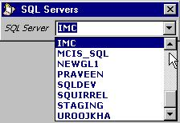

<div align="center">

## GetSQLServers


</div>

### Description

Finds SQL Servers on your LAN
 
### More Info
 
Needs you to enter your LAN's Domain name

Modified from code originally uploaded by Mike G (mikeg@ivbnet.com), which I found had a couple of problems. This version seems to fix them.

Returns a list of all SQL Servers found, in this example it places them into a combobox control

?


<span>             |<span>
---                |---
**Submitted On**   |2001-04-16 14:03:32
**By**             |[Brian Battles WS1O](https://github.com/Planet-Source-Code/PSCIndex/blob/master/ByAuthor/brian-battles-ws1o.md)
**Level**          |Intermediate
**User Rating**    |4.8 (19 globes from 4 users)
**Compatibility**  |VB 6\.0
**Category**       |[Databases/ Data Access/ DAO/ ADO](https://github.com/Planet-Source-Code/PSCIndex/blob/master/ByCategory/databases-data-access-dao-ado__1-6.md)
**World**          |[Visual Basic](https://github.com/Planet-Source-Code/PSCIndex/blob/master/ByWorld/visual-basic.md)
**Archive File**   |[GetSQLServ184584162001\.zip](https://github.com/Planet-Source-Code/brian-battles-ws1o-getsqlservers__1-22463/archive/master.zip)

### API Declarations

```
' kernel32 declaration
Private Declare Sub CopyMemory Lib "kernel32" Alias _
    "RtlMoveMemory" (Destination As Any, _
             Source As Any, _
             ByVal Length As Long)
' netapi declarations
Private Declare Function NetServerEnum Lib "netapi32" ( _
    strServername As Any, _
    ByVal Level As Long, _
    bufPtr As Long, _
    ByVal PrefMaxLen As Long, _
    EntriesRead As Long, _
    TotalEntries As Long, _
    ByVal ServerType As Long, _
    strDomain As Any, _
    ResumeHandle As Long) As Long
Private Declare Function NetApiBufferFree Lib "Netapi32.dll" _
    (ByVal lpBuffer As Long) As Long
```


